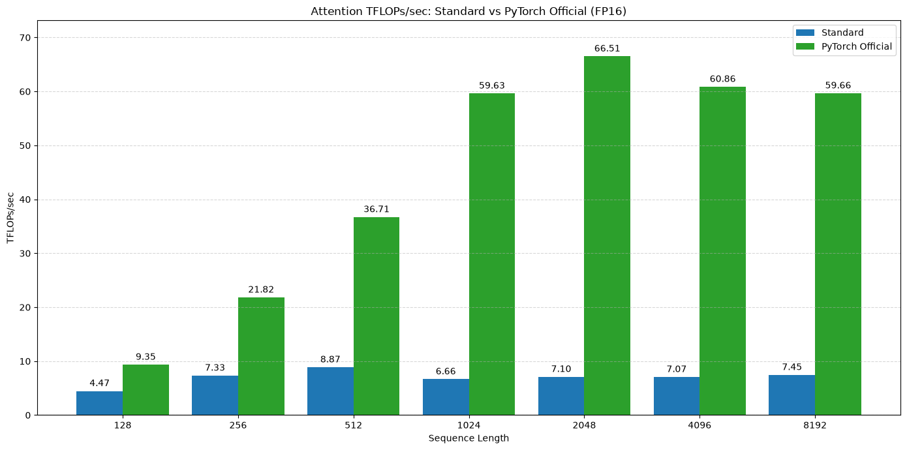

# Flash Attention v2 Implementation

## Introduction to attention mechanisms

In its essence, the self-attention operation is

$$
\text{Attention}(Q, K, V) = \text{softmax}\left(\frac{QK^T}{\sqrt{d_k}}\right)V
$$

so matrix multiplications and a softmax.

Easiest attention mechanism to implement is

Now, there are 3 common attention mechanisms:

1. Multi-head attention
2. Multi-query attention
3. Grouped Query attention

There is also single head attention, which is just a single $Q, K, V$ matrix for the entire sequence.
But it is not used in practice due to lower representation power.

In multi-head attention, each head is basically a separate attention mechanism.
So each query head gets its own key and value matrices.

For the multi-query attention, we have a single key and value matrix shared for all the heads.

Grouped Query attention is a middle ground between the two. We have multiple key and value matrices, but each one is used for multiple heads.
So, for example, if we have 8 heads, we can have 2 key and value matrices, each used for 4 heads.

| Variant | Query heads | Key/value heads | Main advantage | Main disadvantage |
|---|---:|---:|---|---|
| Single-head attention | 1 | 1 | Simple and inexpensive | Limited representational diversity |
| MHA | h | h | Each head can learn different relationships | Large KV cache; slower decoding |
| GQA | h | Several | Strong quality/efficiency balance | Slightly less flexible than MHA |
| MQA | h | 1 shared pair | Very small KV cache; fast generation | Can reduce quality |

Since for each key-value head, we need to store different KV cache, the size of the KV cache is directly proportional to the number of key-value heads.
And during the decoding process, moving around and updating the KV cache is a substantial overhead.
Because of this, MQA with a single key and value matrix is faster in decoding than the MHA.

Now, let's look at the dimensions of the matrices a bit more closely.
We will use the following notation:
- $B$: batch size
- $L$: sequence length
- $d_{model}$: model dimension
- $H_q$: number of query heads
- $H_{kv}$: number of key-value heads
- $d_h$: dimension of the query head

and normally $d_h = d_{model} / H_q$.
For a decoder LLM, the self attention uses the same input $X \in \mathbb{R}^{B \times L \times d_{model}}$ for all the heads, so we have $Q = XW_q$, $K = XW_k$, and $V = XW_v$.

For the packed $W_q, W_k, W_v$ matrices (where packed means that separate projection matrices for all heads are concatenated into one larger matrix), we have

$$
W_Q\in\mathbb{R}^{d_{\text{model}}\times(H_qd_h)}
$$
$$
W_K\in\mathbb{R}^{d_{\text{model}}\times(H_{kv}d_h)}
$$
$$
W_V\in\mathbb{R}^{d_{\text{model}}\times(H_{kv}d_h)}
$$

The projected tensors before splitting into heads are:
$$
Q_{\text{packed}}\in\mathbb{R}^{B\times L\times(H_qd_h)}
$$
$$
K_{\text{packed}},V_{\text{packed}}
\in\mathbb{R}^{B\times L\times(H_{kv}d_h)}
$$
After splitting into heads and transposing for an attention kernel:
$$
Q\in\mathbb{R}^{B\times H_q\times L\times d_h}
$$
$$
K,V\in\mathbb{R}^{B\times H_{kv}\times L\times d_h}
$$
The only architectural difference among MHA, GQA, and MQA is $H_{kv}$.

Let's look at how packing works for a single head. 
Packing concatenates the separate projection matrices for all heads along their output-column dimension:
$$
W_Q=
\begin{bmatrix}
W_Q^{(0)} &
W_Q^{(1)} &
\cdots &
W_Q^{(H_q-1)}
\end{bmatrix}
$$
Its shape becomes:
$$
W_Q:
[d_{\text{model}},H_qd_h]
$$
Now one matrix multiplication computes all query heads:
$$
Q_{\text{packed}}=XW_Q
$$
Because block-matrix multiplication distributes:
$$
X
\begin{bmatrix}
W_Q^{(0)} & W_Q^{(1)} & \cdots
\end{bmatrix}
=
\begin{bmatrix}
XW_Q^{(0)} & XW_Q^{(1)} & \cdots
\end{bmatrix}
$$
The output shape is:
$$
Q_{\text{packed}}:[B,L,H_qd_h]
$$
It is then reshaped into explicit heads:
$$
[B,L,H_qd_h]
\rightarrow
[B,L,H_q,d_h]
$$
and often transposed for the attention kernel:
$$
[B,L,H_q,d_h]
\rightarrow
[B,H_q,L,d_h]
$$

So, in summary

| Tensor | MHA | GQA | MQA |
|---|---|---|---|
| $X$ | $[B,L,d_{\text{model}}]$ | Same | Same |
| $W_Q$ | $[d_{\text{model}},H_qd_h]$ | Same | Same |
| $W_K$ | $[d_{\text{model}},H_qd_h]$ | $[d_{\text{model}},H_{kv}d_h]$ | $[d_{\text{model}},d_h]$ |
| $W_V$ | $[d_{\text{model}},H_qd_h]$ | $[d_{\text{model}},H_{kv}d_h]$ | $[d_{\text{model}},d_h]$ |
| $W_O$ | $[H_qd_h,d_{\text{model}}]$ | Same | Same |
| $Q$ | $[B,H_q,L,d_h]$ | Same | Same |
| $K$ | $[B,H_q,L,d_h]$ | $[B,H_{kv},L,d_h]$ | $[B,1,L,d_h]$ |
| $V$ | $[B,H_q,L,d_h]$ | $[B,H_{kv},L,d_h]$ | $[B,1,L,d_h]$ |

In our case, we will be focusing on the MHA case.

## Naive attention implementation

```python
def naive_attention(Q: Float[Tensor, " ... L d_h"],
                    K: Float[Tensor, " ... L d_k"],
                    V: Float[Tensor, " ... L d_k"],
                    mask: Bool[Tensor, " ... L L"] | None = None) -> Float[Tensor, " ... L d_k"]:
    """
    Naive attention implementation.
    """
    d_k = K.shape[-1]
    scores = einsum(Q, K, "... query d, ... key d -> ... query key") / math.sqrt(d_k)
    if mask is not None:
        scores = torch.where(mask, scores, float("-inf"))
    weights = torch.softmax(scores, dim=-1)
    return einsum(weights, V, "... query key, ... key d -> ... query d")

def pytorch_attention(Q: Float[Tensor, " ... L d_h"],
                      K: Float[Tensor, " ... L d_k"],
                      V: Float[Tensor, " ... L d_k"],
                      mask: Bool[Tensor, " ... L L"] | None = None) -> Float[Tensor, " ... L d_k"]:
    """
    PyTorch attention implementation.
    """
    return torch.nn.functional.scaled_dot_product_attention(Q, K, V, attn_mask=mask)
```

When we compare the naive attention implementation with the PyTorch official implementation with batch_size=4, num_heads=8, head_dim=96, dtype=torch.float16 on L4 GPU, we get the following results:



Now the main problem with the naive implementation is that it is not efficient.
We compute the $QK^T$ matrix by reading the $Q$ and $K$ into memory and then save the result to memory.
Then read that result to compute softmax and then save it to memory.
And then read that new result to do the matrix multiplication with the $V$ matrix and return it.
This is a lot of memory reads and writes, and the goal of the flash attention is to minimize this overhead.

## Flash Attention Implementation

Now, we will first try to understand how the flash attention implementation works conceptually.
For the sake of simplicity, we will focus on a single head with no batch dimension and $d_h = d_k = d$.
So, we have $Q, K, V \in \mathbb{R}^{L \times d}$.

Let's call the $\frac{QK^T}{\sqrt{d}}$ matrix as the scores matrix, $S \in \mathbb{R}^{L \times L}$, $P = \text{softmax}(S) \in \mathbb{R}^{L \times L}$, and $O = PV \in \mathbb{R}^{L \times d}$.

In this case, $S_{i,j} = \frac{1}{\sqrt{d}} \sum_{r=1}^{d} Q_{i,r} K_{j, r}$, so a row $i$ of $Q$ is multiplied by the row $j$ of $K$.
Then, $P_{i,j} = \frac{e^{S_{i,j}}}{\sum_{l=1}^{L} e^{S_{i,l}}}$ is the softmax of the scores matrix.
This means that to compute a row of $P$, we only need the corresponding row of $Q$ but all the rows of $K$.
Continuing on, $O_{i,j} = \sum_{l=1}^{L} P_{i,l} V_{l,j}$, so a row $i$ of $O$ depends on the corresponding row of $P$ and entire $V$.