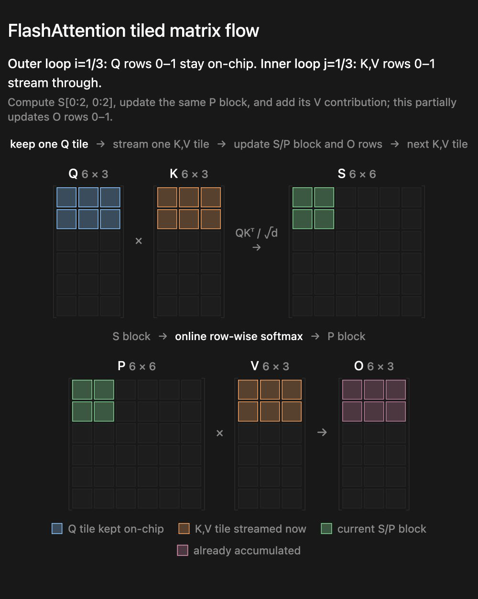
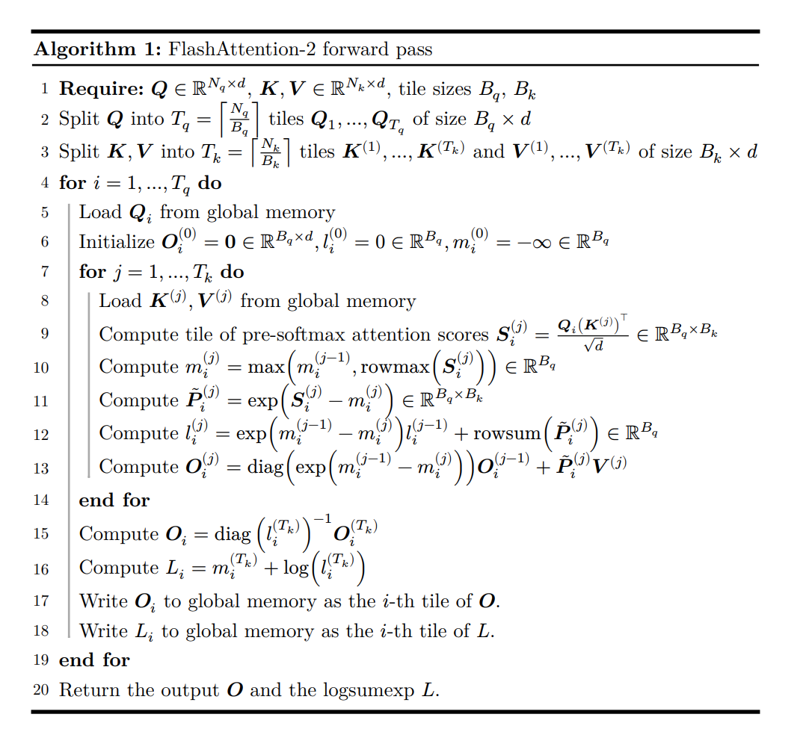
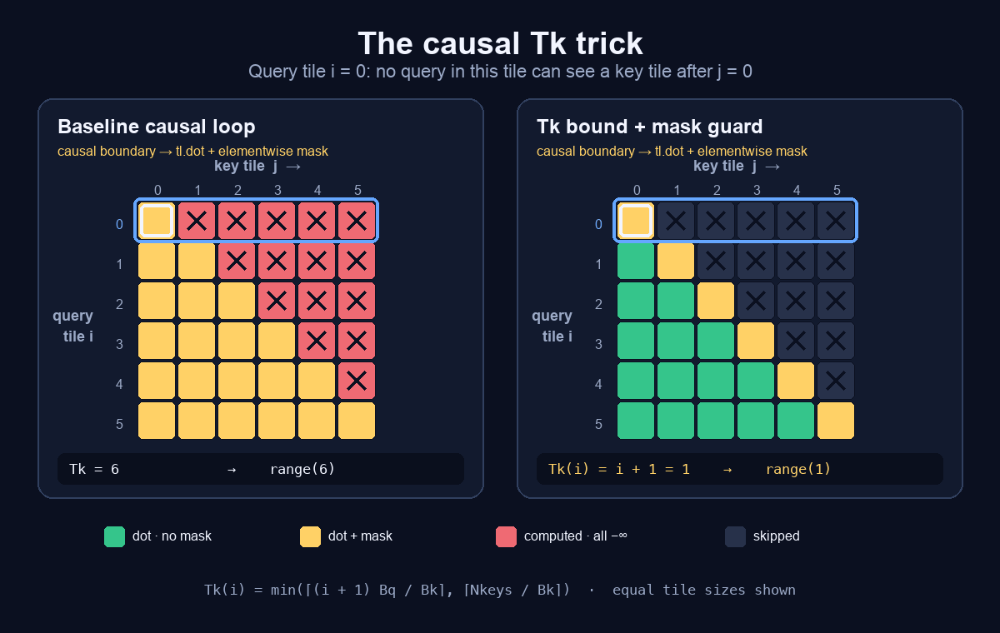
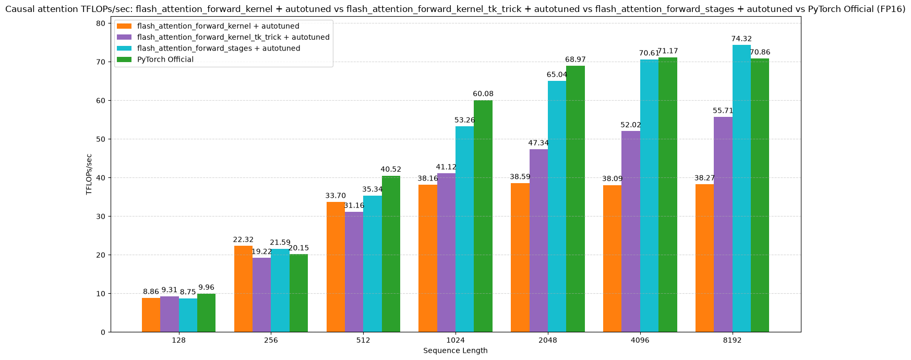

# Flash Attention v2 Forward Pass Implementation

## Introduction to attention mechanisms

In its essence, the self-attention operation is

$$
\text{Attention}(Q, K, V) = \text{softmax}\left(\frac{QK^T}{\sqrt{d_k}}\right)V
$$

so matrix multiplications and a softmax.

There are 3 common attention mechanisms:

1. Multi-head attention
2. Multi-query attention
3. Grouped Query attention

There is also single head attention, which is just a single $Q, K, V$ matrix for the entire sequence.
But it is not used in practice due to lower representation power.

In multi-head attention, each head is basically a separate attention mechanism.
So each query head gets its own key and value matrices.

For the multi-query attention, we have a single key and value matrix shared for all the heads.

Grouped Query attention is a middle ground between the two. We have multiple key and value matrices, but each one is used for multiple heads.
So, for example, if we have 8 heads, we can have 2 key and value matrices, each used for 4 heads.

| Variant | Query heads | Key/value heads | Main advantage | Main disadvantage |
|---|---:|---:|---|---|
| Single-head attention | 1 | 1 | Simple and inexpensive | Limited representational diversity |
| MHA | h | h | Each head can learn different relationships | Large KV cache; slower decoding |
| GQA | h | Several | Strong quality/efficiency balance | Slightly less flexible than MHA |
| MQA | h | 1 shared pair | Very small KV cache; fast generation | Can reduce quality |

Since for each key-value head, we need to store different KV cache, the size of the KV cache is directly proportional to the number of key-value heads.
And during the decoding process, moving around and updating the KV cache is a substantial overhead.
Because of this, MQA with a single key and value matrix is faster in decoding than the MHA.

Now, let's look at the dimensions of the matrices a bit more closely.
We will use the following notation:
- $B$: batch size
- $L$: sequence length
- $d_{model}$: model dimension
- $H_q$: number of query heads
- $H_{kv}$: number of key-value heads
- $d_h$: dimension of the query head

and normally $d_h = d_{model} / H_q$.
For a decoder LLM, the self attention uses the same input $X \in \mathbb{R}^{B \times L \times d_{model}}$ for all the heads, so we have $Q = XW_q$, $K = XW_k$, and $V = XW_v$.

For the packed $W_q, W_k, W_v$ matrices (where packed means that separate projection matrices for all heads are concatenated into one larger matrix), we have

$$
W_Q\in\mathbb{R}^{d_{\text{model}}\times(H_qd_h)}
$$
$$
W_K\in\mathbb{R}^{d_{\text{model}}\times(H_{kv}d_h)}
$$
$$
W_V\in\mathbb{R}^{d_{\text{model}}\times(H_{kv}d_h)}
$$

The projected tensors before splitting into heads are:
$$
Q_{\text{packed}}\in\mathbb{R}^{B\times L\times(H_qd_h)}
$$
$$
K_{\text{packed}},V_{\text{packed}}
\in\mathbb{R}^{B\times L\times(H_{kv}d_h)}
$$
After splitting into heads and transposing for an attention kernel:
$$
Q\in\mathbb{R}^{B\times H_q\times L\times d_h}
$$
$$
K,V\in\mathbb{R}^{B\times H_{kv}\times L\times d_h}
$$
The only architectural difference among MHA, GQA, and MQA is $H_{kv}$.

Let's look at how packing works for a single head. 
Packing concatenates the separate projection matrices for all heads along their output-column dimension:
$$
W_Q=
\begin{bmatrix}
W_Q^{(0)} &
W_Q^{(1)} &
\cdots &
W_Q^{(H_q-1)}
\end{bmatrix}
$$
Its shape becomes:
$$
W_Q:
[d_{\text{model}},H_qd_h]
$$
Now one matrix multiplication computes all query heads:
$$
Q_{\text{packed}}=XW_Q
$$
Because block-matrix multiplication distributes:
$$
X
\begin{bmatrix}
W_Q^{(0)} & W_Q^{(1)} & \cdots
\end{bmatrix}
=
\begin{bmatrix}
XW_Q^{(0)} & XW_Q^{(1)} & \cdots
\end{bmatrix}
$$
The output shape is:
$$
Q_{\text{packed}}:[B,L,H_qd_h]
$$
It is then reshaped into explicit heads:
$$
[B,L,H_qd_h]
\rightarrow
[B,L,H_q,d_h]
$$
and often transposed for the attention kernel:
$$
[B,L,H_q,d_h]
\rightarrow
[B,H_q,L,d_h]
$$

So, in summary

| Tensor | MHA | GQA | MQA |
|---|---|---|---|
| $X$ | $[B,L,d_{\text{model}}]$ | Same | Same |
| $W_Q$ | $[d_{\text{model}},H_qd_h]$ | Same | Same |
| $W_K$ | $[d_{\text{model}},H_qd_h]$ | $[d_{\text{model}},H_{kv}d_h]$ | $[d_{\text{model}},d_h]$ |
| $W_V$ | $[d_{\text{model}},H_qd_h]$ | $[d_{\text{model}},H_{kv}d_h]$ | $[d_{\text{model}},d_h]$ |
| $W_O$ | $[H_qd_h,d_{\text{model}}]$ | Same | Same |
| $Q$ | $[B,H_q,L,d_h]$ | Same | Same |
| $K$ | $[B,H_q,L,d_h]$ | $[B,H_{kv},L,d_h]$ | $[B,1,L,d_h]$ |
| $V$ | $[B,H_q,L,d_h]$ | $[B,H_{kv},L,d_h]$ | $[B,1,L,d_h]$ |

In our case, we will be focusing on the MHA case.

## Naive attention implementation

```python
def naive_attention(Q: Float[Tensor, " ... L d_h"],
                    K: Float[Tensor, " ... L d_k"],
                    V: Float[Tensor, " ... L d_k"],
                    mask: Bool[Tensor, " ... L L"] | None = None) -> Float[Tensor, " ... L d_k"]:
    """
    Naive attention implementation.
    """
    d_k = K.shape[-1]
    scores = einsum(Q, K, "... query d, ... key d -> ... query key") / math.sqrt(d_k)
    if mask is not None:
        scores = torch.where(mask, scores, float("-inf"))
    weights = torch.softmax(scores, dim=-1)
    return einsum(weights, V, "... query key, ... key d -> ... query d")

def pytorch_attention(Q: Float[Tensor, " ... L d_h"],
                      K: Float[Tensor, " ... L d_k"],
                      V: Float[Tensor, " ... L d_k"],
                      mask: Bool[Tensor, " ... L L"] | None = None) -> Float[Tensor, " ... L d_k"]:
    """
    PyTorch attention implementation.
    """
    return torch.nn.functional.scaled_dot_product_attention(Q, K, V, attn_mask=mask)
```

When we compare the non-causal naive attention implementation with the PyTorch official implementation with batch_size=4, num_heads=8, head_dim=96, dtype=torch.float16 on L4 GPU, we get the following results:


Now the main problem with the naive implementation is that it is not efficient.
We compute the $QK^T$ matrix by reading the $Q$ and $K$ into memory and then save the result to memory.
Then read that result to compute softmax and then save it to memory.
And then read that new result to do the matrix multiplication with the $V$ matrix and return it.
This is a lot of memory reads and writes, and the goal of the flash attention is to minimize this overhead.

## Flash Attention Implementation

Overarching goal is to fuse the three steps of attention into a single kernel.
The naive implementation is three kernel launches and the intermediates $S$ and $P$ are O(N^2), so they get fully materialized in HBM and reread by the next launch.
Fusing means $S_{ij}$ and $P_{ij}$ stay in registers / SRAM and never touch HBM.

Now, we will first try to understand how the flash attention implementation works conceptually.
For the sake of simplicity, we will focus on a single head with no batch dimension and $d_h = d_k = d$.
So, we have $Q, K, V \in \mathbb{R}^{L \times d}$.

Let's call the $\frac{QK^T}{\sqrt{d}}$ matrix as the scores matrix, $S \in \mathbb{R}^{L \times L}$, $P = \text{softmax}(S) \in \mathbb{R}^{L \times L}$, and $O = PV \in \mathbb{R}^{L \times d}$.

In this case, $S_{i,j} = \frac{1}{\sqrt{d}} \sum_{r=1}^{d} Q_{i,r} K_{j, r}$, so a row $i$ of $Q$ is multiplied by the row $j$ of $K$.
Then, $P_{i,j} = softmax(S_{i,j}) = \frac{e^{S_{i,j}}}{\sum_{l=1}^{L} e^{S_{i,l}}}$ is the softmax of the scores matrix.
This means that to compute a row of $P$, we only need the corresponding row of $Q$ but all the rows of $K$.
Continuing on, $O_{i,j} = \sum_{l=1}^{L} P_{i,l} V_{l,j}$, so a row $i$ of $O$ depends on the corresponding row of $P$ and entire $V$.
What this tells us is that every row of $O$ needs only the corresponding row from the $Q$ matrix.
It then intuitively makes sense that we iterate over the rows of $Q$ (in batches) in outer loop and $K$ and $V$ in inner loop.

Now, we can't load the entire $K$ and $V$ matrices into memory at once.
So, we will process them in batches of rows as well.

<picture>
  <source srcset="figures/flash_attention_tiled_flow.webp" type="image/webp">
  
</picture>

Let's say we have tiles of sizes $B_q$ and $B_k$ for the $Q$ and $K, V$ matrices respectively.
We can then split $Q$ into $T_q = \left\lceil \frac{L}{B_q} \right\rceil$ tiles $Q_1, \ldots, Q_{T_q}$ of size $B_q \times d$.
Similarly, we can split $K, V$ into $T_k = \left\lceil \frac{L}{B_k} \right\rceil$ tiles $K^{(1)}, \ldots, K^{(T_k)}$ and $V^{(1)}, \ldots, V^{(T_k)}$ of size $B_k \times d$.

Now, for any $Q_i$, assume we start with $K^{(1)}$ and $V^{(1)}$ in memory.
We can easily compute the $S_i^{1} = \frac{1}{\sqrt{d}} Q_i K^{(1)^T} \in \mathbb{R}^{B_q \times B_k}$ matrix.
But how can we then compute the softmax of it?
The problem is the softmax is dependent on the entire row of $S$, so all $L$ elements of the row, but we only have the $B_k$ columns of that row in memory at any given time.
There, the online softmax algorithm comes to the rescue.

### Online softmax algorithm

The softmax is defined as:
$$
\text{softmax}(x)_i = \frac{e^{x_i}}{\sum_{j=1}^{L} e^{x_j}} = \frac{e^{x_i - m_x}}{\sum_{j=1}^{L} e^{x_j - m_x}}
$$
where $m_x = \max(x)$ is the maximum value in the vector $x$ for the sake of numerical stability.
Again, the problem there is, both the $m_x$ and the sum of the exponential terms are dependent on the entire row of $S$, but we get them in chunks of $B_k$ columns at a time.
Now, say that $m_i$ is the maximum element in the vector from 1 to $i$, and $l_i$ is the sum of the exponential terms from 1 to $i$, $l_i = \sum_{j=1}^{i} e^{x_j - m_i}$.

Then, expanding the sum and re-centering the exponentials around the previous maximum gives the recurrence:

$$
\begin{aligned}
l_i &= \sum_{j=1}^{i} e^{x_j - m_i} \\
&= \sum_{j=1}^{i-1} e^{x_j - m_i} + e^{x_i - m_i} \\
&= \sum_{j=1}^{i-1} e^{x_j - m_{i-1}} \cdot e^{m_{i-1} - m_i} + e^{x_i - m_i} \\
&= l_{i-1} \cdot e^{m_{i-1} - m_i} + e^{x_i - m_i}
\end{aligned}
$$

This then gives us the following algorithm for online softmax:

```python
def online_softmax(x):
    m = float("-inf")
    l = 0.0

    # Online pass: compute the final maximum and denominator.
    for xi in x:
        m_new = max(m, xi)
        l = l * exp(m - m_new) + exp(xi - m_new)
        m = m_new

    # Output pass: compute the normalized probabilities.
    return [exp(xi - m) / l for xi in x]
```

Now, going back to our problem, assume that we are at tile $i$ for the $Q$ and tile $j$ for the $K$ and $V$.
We also have $l_i^{j-1} \in \mathbb{R}^{B_q \times B_k}$ and $m_i^{j-1} \in \mathbb{R}^{B_q}$ along with $O_i^{j-1} \in \mathbb{R}^{B_q \times d}$ from the previous step.
Here, $l$ is the running proxy for the denominator of the softmax just like we had in the online softmax algorithm, and $m$ is the running maximum value in the row.
For the $Q_i$ and $K^{(j)}, V^{(j)}$ tiles, we can compute the $S_i^{j} = \frac{1}{\sqrt{d}} Q_i K^{(j)^T} \in \mathbb{R}^{B_q \times B_k}$ matrix.
We have $B_q$ rows, and since each row is independent of the others, we compute the $m_i^{j} = max(m_i^{j-1}, rowmax(S_i^{j})) \in \mathbb{R}^{B_q}$ vector.
Then, $\tilde{P}_i^{j} = e^{S_i^{j} - m_i^{j}} \in \mathbb{R}^{B_q \times B_k}$ matrix.
Now, we need to compute the $l_i^{j} \in \mathbb{R}^{B_q}$ vector.
Looking at the online softmax algorithm, and keeping in mind we are not looking at a single element, rather a batch of columns in each row, we can see that the recurrence relation for $l_i^{j}$ is:

$$
l_i^{j} = l_i^{j-1} \cdot e^{m_i^{j-1} - m_i^{j}} + rowsum(\tilde{P}_i^{j})
$$

Now, for a batch of rows in the $O$ matrix, we can compute the partial results for each tile of $K$ and $V$ in the inner loop and update the old results as we accumulate them.

$$
O_i^{j} = diag(e^{m_i^{j-1} - m_i^{j}}) O_i^{j-1} + \tilde{P}_i^{j} V_i^{j-1}
$$

Here, note that the $O_i^{j}$ is the numerator of the final result.
Once the inner loop is done, we will update it as $O_i = diag(l_i^{T_k})^ {-1} O_i^{T_k}$.
So, basically we will divide the result by the summed exponential coming from the softmax computation.
The full algorithm is as follows:



The logsum is there because it will be used in the backwards pass.

## Triton Implementation

Now, let's look at the Triton implementation of the flash attention forward pass.

```python
@triton.jit
def flash_attention_forward_kernel(
    Q_ptr, #[B, Hq, Lq, D]
    K_ptr, #[B, Hk, Lk, D]
    V_ptr, #[B, Hk, Lk, D]
    O_ptr, #[B, Hq, Lq, D]
    L_ptr, #[B, Hq, Lq]
    stride_qb: tl.constexpr, stride_qh: tl.constexpr, stride_qq: tl.constexpr, stride_qd: tl.constexpr,
    stride_kb: tl.constexpr, stride_kh: tl.constexpr, stride_kk: tl.constexpr, stride_kd: tl.constexpr,
    stride_vb: tl.constexpr, stride_vh: tl.constexpr, stride_vk: tl.constexpr, stride_vd: tl.constexpr,
    stride_ob: tl.constexpr, stride_oh: tl.constexpr, stride_oq: tl.constexpr, stride_od: tl.constexpr,
    stride_lb: tl.constexpr, stride_lh: tl.constexpr, stride_lq: tl.constexpr,
    N_QUERIES: tl.constexpr, N_KEYS: tl.constexpr,
    scale: tl.constexpr,
    D: tl.constexpr,
    Q_TILE_SIZE: tl.constexpr,
    K_TILE_SIZE: tl.constexpr,
    is_causal: tl.constexpr,
    Hq: tl.constexpr,
):
    query_tile_index = tl.program_id(0)
    head_index = tl.program_id(1) % Hq
    batch_index = tl.program_id(1) // Hq

    Q_block_ptr = tl.make_block_ptr(
        Q_ptr + batch_index * stride_qb + head_index * stride_qh,
        shape=(N_QUERIES, D),
        strides=(stride_qq, stride_qd),
        offsets=(query_tile_index * Q_TILE_SIZE, 0),
        block_shape=(Q_TILE_SIZE, triton.next_power_of_2(D)),
        order=(1, 0),
    )

    K_block_ptr = tl.make_block_ptr(
        K_ptr + batch_index * stride_kb + head_index * stride_kh,
        shape=(N_KEYS, D),
        strides=(stride_kk, stride_kd),
        offsets=(0, 0), # we will loop over the entire key matrix
        block_shape=(K_TILE_SIZE, triton.next_power_of_2(D)),
        order=(1, 0),
    )

    V_block_ptr = tl.make_block_ptr(
        V_ptr + batch_index * stride_vb + head_index * stride_vh,
        shape=(N_KEYS, D),
        strides=(stride_vk, stride_vd),
        offsets=(0, 0),
        block_shape=(K_TILE_SIZE, triton.next_power_of_2(D)),
        order=(1, 0),
    )

    O_block_ptr = tl.make_block_ptr(
        O_ptr + batch_index * stride_ob + head_index * stride_oh,
        shape=(N_QUERIES, D),
        strides=(stride_oq, stride_od),
        offsets=(query_tile_index * Q_TILE_SIZE, 0),
        block_shape=(Q_TILE_SIZE, triton.next_power_of_2(D)),
        order=(1, 0),
    )

    L_block_ptr = tl.make_block_ptr(
        L_ptr + batch_index * stride_lb + head_index * stride_lh,
        shape=(N_QUERIES,),
        strides=(stride_lq,),
        offsets=(query_tile_index * Q_TILE_SIZE,),
        block_shape=(Q_TILE_SIZE,),
        order=(0,),
    )

    Qi = tl.load(Q_block_ptr, boundary_check=(0, 1), padding_option="zero") # (Q_TILE_SIZE, D)
    Oi = tl.zeros((Q_TILE_SIZE, triton.next_power_of_2(D)), dtype=tl.float32) # (Q_TILE_SIZE, D)
    li = tl.zeros((Q_TILE_SIZE,), dtype=tl.float32) # (Q_TILE_SIZE,)
    mi = tl.full((Q_TILE_SIZE,), -float('inf'), dtype=tl.float32) # (Q_TILE_SIZE,)

    # Baseline: visit every key tile, including masked future tiles.
    Tk = tl.cdiv(N_KEYS, K_TILE_SIZE)
    for j in range(Tk):
        Kj = tl.load(K_block_ptr, boundary_check=(0, 1), padding_option="zero") # (K_TILE_SIZE, D)
        Vj = tl.load(V_block_ptr, boundary_check=(0, 1), padding_option="zero") # (K_TILE_SIZE, D)
        Sij = tl.dot(Qi, Kj.T) * scale # (Q_TILE_SIZE, K_TILE_SIZE)
        # Due to padding, some parts of the Sij matrix will be 0
        # But, this would mess up the softmax operation,
        # so we need to identify the padded elements and set the corresponding elements of Sij to -inf
        # now, the padding from the 0th dimension of Q is irrelevant since softmax is apllied along for each row separately, so any extra rows in S will be ignored down the line anyways
        # the padding along the 1st dimension of Q and K is also irrelevant since we will be multiplying all the elements along the D dimension of Q and K, so padded parts will be adding 0 to summation
        # But we need to take care of the padding along the 0th dimension of K, since padded parts there will be adding columns filled with 0s to the Sij matrix, which then messes up the denominator of softmax
        k_offsets = j * K_TILE_SIZE + tl.arange(0, K_TILE_SIZE) # (K_TILE_SIZE,)
        Sij = tl.where(k_offsets[None, :] < N_KEYS, Sij, -float('inf'))
        if is_causal:
            q_offsets = query_tile_index * Q_TILE_SIZE + tl.arange(0, Q_TILE_SIZE)
            mask = q_offsets[:, None] >= k_offsets[None, :]
            Sij = tl.where(mask, Sij, -float('inf'))
        mi_new = tl.maximum(mi, tl.max(Sij, axis=-1)) # (Q_TILE_SIZE,)
        Pij = tl.exp(Sij - mi_new[:, None]) # (Q_TILE_SIZE, K_TILE_SIZE)
        alpha = tl.exp(mi - mi_new)
        li = alpha * li + tl.sum(Pij, axis=-1) # (Q_TILE_SIZE,)
        Oi = tl.dot(Pij.to(Vj.dtype), Vj, Oi * alpha[:, None]) # (Q_TILE_SIZE, D)
        mi = mi_new
        K_block_ptr = tl.advance(K_block_ptr, (K_TILE_SIZE, 0))
        V_block_ptr = tl.advance(V_block_ptr, (K_TILE_SIZE, 0))

    Oi = Oi * (1.0 / li[:, None])
    # Natural-log logsumexp from the running softmax state.
    Li = mi + tl.log(li)
    tl.store(O_block_ptr, Oi.to(O_block_ptr.type.element_ty), boundary_check=(0, 1))
    tl.store(L_block_ptr, Li, boundary_check=(0,))
```

This implementation strictly follows the algorithm we described above with the only difference being added causal masking.
But, as we are doing the causal masking, we realize that a query tile can never attend to key tiles that lie completely to its right. The baseline still visits those tiles, loads $K_j$ and $V_j$, computes $S_{ij}$, and then masks every score to $-\infty$.

We can avoid that work by making the number of key tiles depend on the current query tile:

$$
T_k(i) = \min\left(
\left\lceil\frac{(i+1)B_q}{B_k}\right\rceil,
\left\lceil\frac{N_{keys}}{B_k}\right\rceil
\right)
$$

There is a second saving inside that shortened loop. A key tile lying completely to the left of the query tile is fully visible, so it can go straight from `tl.dot` to the online-softmax update without constructing a causal mask. Only a key tile that overlaps the causal boundary enters the masking branch.

<picture>
  <source srcset="figures/flash_attention_tk_trick.webp" type="image/webp">
  
</picture>

When $B_q = B_k$, query tile $i$ only needs key tiles $0$ through $i$. Thus the causal kernel performs roughly half as many tile iterations as the baseline over the whole attention matrix.

```python
    ... # previous code
    # For causal attention, key tiles whose smallest key index is already past
    # the largest query index in this query tile would have Sij entirely masked
    # to -inf -- which is a no-op for the running (mi, li, Oi) state but still
    # costs two tl.loads, a tl.dot, and the mask/exp work. Tightening the loop
    # bound to skip those tiles cuts work roughly in half for causal and is
    # what makes causal attention actually faster than full attention.
    if is_causal:
        # Last reachable key index for this query tile is
        #   (query_tile_index + 1) * Q_TILE_SIZE - 1,
        # so the number of key tiles we need to visit is
        #   ceil(((query_tile_index + 1) * Q_TILE_SIZE) / K_TILE_SIZE).
        # Also clamp to the actual number of key tiles so we don't run past N_KEYS.
        Tk = tl.minimum(
            tl.cdiv((query_tile_index + 1) * Q_TILE_SIZE, K_TILE_SIZE),
            tl.cdiv(N_KEYS, K_TILE_SIZE),
        )
    else:
        Tk = tl.cdiv(N_KEYS, K_TILE_SIZE)
    for j in range(Tk):
        ... # previous code
        if is_causal:
            # Earlier key tiles are fully visible; only overlapping tiles need a mask.
            if (j + 1) * K_TILE_SIZE > query_tile_index * Q_TILE_SIZE:
                q_offsets = query_tile_index * Q_TILE_SIZE + tl.arange(0, Q_TILE_SIZE)
                mask = q_offsets[:, None] >= k_offsets[None, :]
                Sij = tl.where(mask, Sij, -float('inf'))
        ... # previous code
```

This implementation is now more efficient than the baseline for causal attention for larger sequence lengths.

But, we can do even better by explicitly stating the different stages of the algorithm in the kernel. In the first stage, we look at the key tiles that do not need to be masked, and in the second stage, we look at the key tiles that need to be masked.

```python
... # previous code
    # If the attention is not causal, then there is no need for masking anyways
    # But if it is causal, then we can have 2 stages
    # first stage: all the key tile is visible to the query tile
    # second stage: some parts of the key tile is not visible to the query tile so we need to do masking


    # Stop before fully masked future key tiles in causal attention.
    if is_causal:
        Tk = tl.minimum(
            tl.cdiv((query_tile_index + 1) * Q_TILE_SIZE, K_TILE_SIZE),
            tl.cdiv(N_KEYS, K_TILE_SIZE),
        )
    else:
        Tk = tl.cdiv(N_KEYS, K_TILE_SIZE)

    for stage in tl.static_range(2 if is_causal else 1):
        if is_causal:
            split = tl.minimum(query_tile_index * Q_TILE_SIZE // K_TILE_SIZE, Tk)
            lo = 0 if stage == 0 else split
            hi = split if stage == 0 else Tk
        else:
            lo = 0
            hi = Tk
        
        for j in range(lo, hi):
            Kj = tl.load(K_block_ptr, boundary_check=(0, 1), padding_option="zero") # (K_TILE_SIZE, D)
            Vj = tl.load(V_block_ptr, boundary_check=(0, 1), padding_option="zero") # (K_TILE_SIZE, D)
            Sij = tl.dot(Qi, Kj.T) * scale # (Q_TILE_SIZE, K_TILE_SIZE)
            k_offsets = j * K_TILE_SIZE + tl.arange(0, K_TILE_SIZE) # (K_TILE_SIZE,)
            Sij = tl.where(k_offsets[None, :] < N_KEYS, Sij, -float('inf'))
            if is_causal and stage == 1:
                q_offsets = query_tile_index * Q_TILE_SIZE + tl.arange(0, Q_TILE_SIZE)
                mask = q_offsets[:, None] >= k_offsets[None, :]
                Sij = tl.where(mask, Sij, -float('inf'))
            mi_new = tl.maximum(mi, tl.max(Sij, axis=-1)) # (Q_TILE_SIZE,)
            Pij = tl.exp(Sij - mi_new[:, None]) # (Q_TILE_SIZE, K_TILE_SIZE)
            alpha = tl.exp(mi - mi_new)
            li = alpha * li + tl.sum(Pij, axis=-1) # (Q_TILE_SIZE,)
            Oi = tl.dot(Pij.to(Vj.dtype), Vj, Oi * alpha[:, None]) # (Q_TILE_SIZE, D)
            mi = mi_new
            K_block_ptr = tl.advance(K_block_ptr, (K_TILE_SIZE, 0))
            V_block_ptr = tl.advance(V_block_ptr, (K_TILE_SIZE, 0))
    ... # previous code
```

The staged kernel does not reduce the mathematical work relative to the Tk-trick kernel. It separates the common unmasked region and exceptional masked region into statically specialized loops, allowing Triton to generate and software-pipeline a much cleaner inner loop. The single-loop version’s runtime conditional inhibits those compiler optimizations, and independent autotuning may further amplify the difference.

Looking at the benchmark results for causal attention:



We see that the staged kernel performs very similar to the official pytorch implementation.
As we predicted, the Tk-trick and stages do not have an advantage over the baseline kernel for small sequence lengths since any gain from not masking key tiles is completely overshadowed by the additional overhead of the conditional branching.
But, as the sequence length increases, the performance gains become visible.
