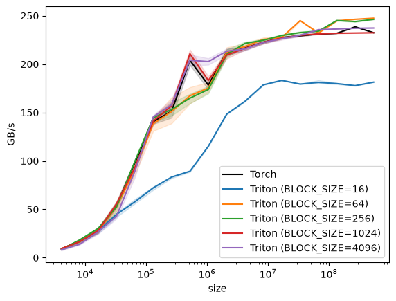
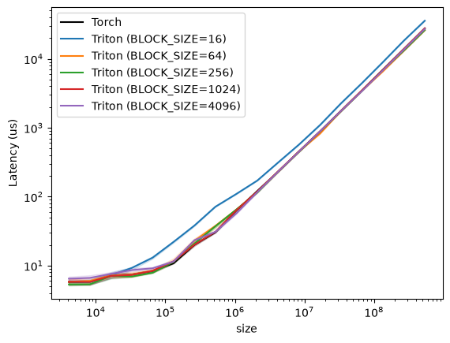
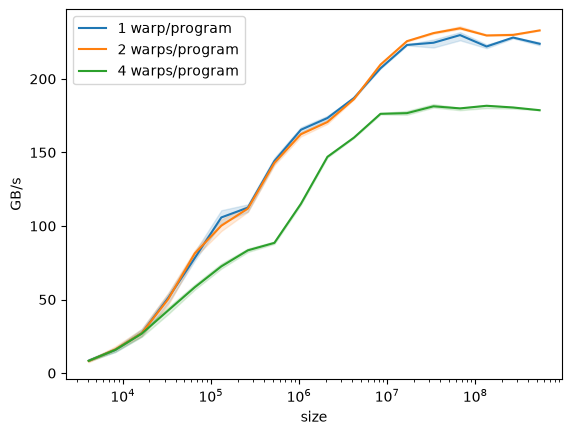

# GPU Basics and Triton Fundamentals

These notes focus on NVIDIA GPUs and use CUDA-style terminology. Other GPU
architectures may use different names and execution widths.

## CPU vs. GPU

CPUs generally optimize for low latency on a small number of powerful threads,
while GPUs optimize for throughput across many lightweight threads.

All threads execute the same kernel code. On an NVIDIA GPU, threads within a
block are grouped into warps of 32. The active lanes of a warp execute each
issued instruction together, but threads can take different branches. When
they do, the warp executes the required paths with different lanes masked off.
This is the SIMT (Single Instruction, Multiple Threads) model.

Compared with CPUs, GPUs dedicate more hardware to arithmetic
throughput and less to sophisticated control logic and large,
low-latency caches per execution unit.

GPUs have many SMs (streaming multiprocessors) that schedule thread blocks.
An SM contains warp schedulers, a register file, shared memory/L1 cache, and
execution pipelines for operations such as FP32, integer, and matrix arithmetic.
Threads are not permanently assigned to individual execution units; schedulers
issue instructions from ready warps to the appropriate pipelines.

In general, storage closer to the execution pipelines has lower latency and
higher bandwidth. Registers and L1/shared memory are inside an SM, L2 cache is
shared across the GPU, and global memory usually resides in off-chip HBM or
VRAM.

Why can't we just have very large L1 cache?
Because it would be too expensive and too power-hungry.

L1 cache is managed automatically by the hardware, while shared memory is
programmer-managed storage used for deliberate data reuse and communication
within a thread block.

## GPU Execution Model

Threads: Threads execute the kernel code on their assigned data. Within a warp,
the active lanes execute each issued instruction together.

Blocks: Groups of threads. Each block normally runs to completion on one SM and
has its own logical shared-memory allocation. Multiple blocks may be resident on
the same SM.

Warp: On NVIDIA GPUs, threads in a block are partitioned into groups of 32 called
**warps**. Threads in a warp have consecutive linear thread IDs, but the memory
addresses they access are determined by the kernel. A warp is the primary
scheduling unit within an SM.

So, blocks are assigned to SMs, and each block is divided into warps. Each warp contains 32 threads.

Each thread has its own logical registers and can access the shared memory of its
block. Independent blocks generally communicate through global memory and
cannot assume a scheduling order. Thread-block clusters provide an advanced
exception on supported GPUs by allowing access to distributed shared memory.

## Roofline Model

There are two regimes of performance:

- The memory-bound regime: the GPU is bounded by memory bandwidth, how fast can it read/write data.
- The compute-bound regime: the GPU is utilizing its compute units to the fullest.

Arithmetic intensity is the amount of computation performed per byte moved:

$$
\text{arithmetic intensity} = \frac{\text{FLOPs}}{\text{bytes moved}}
$$

The simplified roofline bound is:

$$
\text{attainable performance}
\leq
\min(\text{peak compute},\ \text{memory bandwidth} \times \text{arithmetic intensity})
$$

In the memory-bound regime, performance can increase with arithmetic intensity.
In the compute-bound regime, increasing arithmetic intensity alone does not
raise the compute ceiling. The goal is to approach the relevant roofline, not to
make every algorithm compute-bound. For example, a well-optimized vector
addition is still naturally memory-bound.

## How Do We Make a GPU Fast?

Additional source: [What Shapes Do Matrix Multiplications Like?](https://www.thonking.ai/p/what-shapes-do-matrix-multiplications)

Common GPU optimization techniques include:

- Control divergence (not a memory bottleneck)
- Low precision computation
- Operator fusion
- Recomputation
- Coalesced memory access
- Tiling

These techniques affect different bottlenecks. Coalescing and tiling improve
memory access and reuse. Fusion reduces memory traffic and kernel-launch
overhead. Low precision can improve both compute throughput and memory traffic.
Recomputation explicitly trades additional compute for lower memory use.

### Control divergence

GPUs are optimized for SIMT (Single Instruction, Multiple Threads) execution.
The active lanes in a warp execute each issued instruction together.
Conditionals are fine, but if we do something like:

```
if (thread_id <= 3) {
    A;
} else {
    B;
}
```

then, while path $A$ executes, four lanes are active and the others are masked
off. While path $B$ executes, the initial four lanes are masked off and the
remaining lanes are active. This is called control divergence. The precise
instruction sequence depends on compiler decisions such as predication, but the
important effect is reduced lane utilization.

### Low precision computation

#### Bits and bytes

A **bit** is the smallest unit of data—a single 0 or 1. A **byte** is 8 bits
grouped together. The relationship is always: **1 byte = 8 bits**.

The number in a data type's name tells you how many **bits** it uses:

- **float32** (FP32): 32 bits = 32 / 8 = **4 bytes** per number
- **float16** (FP16): 16 bits = 16 / 8 = **2 bytes** per number
- **bfloat16** (BF16): 16 bits = **2 bytes** per number (different exponent/mantissa split than FP16)
- **int8**: 8 bits = **1 byte** per number

Why does this matter for GPUs? Values transferred to or from global memory
consume bandwidth. An FP32 value uses 4 bytes, while an FP16 value uses 2.
Assuming the same access pattern and no additional conversions, storing the
tensors in FP16 halves the bytes transferred by those tensor loads and stores.
This directly helps in the memory-bound regime.

Example from the lecture — elementwise ReLU (\(x = \max(0, x)\)) on a vector of size \(n\):

- **Float32**: 1 read + 1 write = 8 bytes moved per element, 1 operation → 1/8 operation/byte
- **Float16**: 1 read + 1 write = 4 bytes moved per element, 1 operation → 1/4 operation/byte

Half the bytes means double the operational intensity. The operation may still
remain memory-bound, but it can process more elements per unit of memory
bandwidth.

Tensor Cores, introduced with NVIDIA Volta, accelerate supported matrix
multiply-accumulate operations in low or mixed precision. The actual speedup
depends on the GPU, data type, matrix shapes, alignment, and implementation.

#### FP16 vs BF16

Both are 16-bit (2 bytes), but they split those 16 bits differently. A
floating-point number is stored as three fields: **sign** (positive/negative),
**exponent** (the scale/range), and **fraction** (the precision/significant
digits).

- **FP16**: 1 sign + 5 exponent + 10 fraction bits — more precision, smaller range (max ~65,504)
- **BF16**: 1 sign + 8 exponent + 7 fraction bits — less precision, much larger
  range (max ~3.4 × 10³⁸, approximately the same range as FP32)

BF16 keeps the same 8 exponent bits as FP32, so it covers approximately the same
range of magnitudes. This matters for training because gradients and activations
can span a large dynamic range. FP16 values overflow or underflow more easily,
which is why FP16 training often requires loss scaling. BF16 usually needs less
loss scaling, but it is not a universal drop-in replacement for FP32: sensitive
operations and accumulation may still use FP32, and numerical behavior depends
on the model and hardware.

### Operator fusion

If we need to do multiple operations in a row, we can fuse them to reduce the
number of global memory reads and writes.

### Recomputation

The idea is doing more compute instead of storing the intermediate results in memory.
For example, instead of storing all forward-pass activations, we can recompute
selected activations during the backward pass before calculating gradients.

### Coalesced Memory Access

The GPU combines a warp's memory requests into the minimum number of memory
transactions needed to cover the requested addresses. On modern NVIDIA GPUs,
global-memory coalescing is commonly described in terms of 32-byte segments. For
example, 32 consecutive FP32 accesses cover 128 bytes and normally require four
32-byte transactions. Strided or scattered addresses may require many more.

#### Row-major layout

A 2D matrix is stored in memory as a flat 1D array. In **row-major** order (the
default in C/CUDA), rows are stored one after another:

```
Matrix:          Memory (flat):
| 1  2  3 |      [1, 2, 3, 4, 5, 6, 7, 8, 9]
| 4  5  6 |       ^row 0^  ^row 1^  ^row 2^
| 7  8  9 |
```
Elements in the same row are adjacent in memory. Elements in the same column are separated by the row width.

#### Coalescing for matrix multiplication

Coalescing is about what all 32 threads in a warp access **simultaneously**, not what a single thread does over time.

Consider \(C = A \times B\), where each thread computes one element of \(C\).
Each element \(C[i][j]\) is the dot product of row \(i\) of \(A\) and column
\(j\) of \(B\), computed over steps \(k = 0, 1, 2, \ldots\). At each step,
every thread reads one element from \(A\) and one from \(B\). Whether those
reads are coalesced depends on how threads are assigned.

**Bad: threads along a column of C** (thread 0 does `C[0][0]`, thread 1 does `C[1][0]`, etc.):

- **A**: each thread reads from a different row — `A[0][k]`, `A[1][k]`,
  `A[2][k]`, ... These addresses are each \(N\) apart, scattered across memory.
  **Not coalesced.**
- **B**: all threads compute the same column, so they all read `B[k][0]` — the
  exact same address. This is a **broadcast** (one read serves all threads,
  fine).

**Good: threads along a row of C** (thread 0 does `C[0][0]`, thread 1 does `C[0][1]`, etc.):

- **A**: all threads compute the same row, so they all read `A[0][k]` — a **broadcast** (fine).
- **B**: each thread reads an adjacent column — `B[k][0]`, `B[k][1]`,
  `B[k][2]`, ... These addresses are contiguous in row-major memory and can be
  served by the minimum number of transactions. **Coalesced.**

In both cases, one matrix is broadcast (all threads read the same address) and
the other is read by all 32 threads at different addresses. The question is
whether those 32 addresses are contiguous (coalesced) or strided (not
coalesced).

### Tiling

Tiling groups work to increase data reuse and reduce global-memory accesses. For
matrix multiplication, we divide the matrices into smaller tiles, load input
tiles into shared memory, and reuse them across multiple multiply-accumulate
operations.

For a square $N \times N$ matrix multiplication in a simplified implementation,
each input element may be read roughly $N$ times from global memory.

With tile width $T$, each input element is read roughly $\frac{N}{T}$ times from
global memory and reused $T$ times within a tile. This gives an approximate
factor-of-$T$ reduction in global-memory reads. Caching and implementation
details can change the exact traffic.

#### Complexities of tiling

Tile sizes may not divide the matrix dimensions, requiring masks and creating
partially filled boundary tiles.

Tile loads are most efficient when addresses are aligned and accesses are
coalesced. Tile size also affects register use, shared-memory use, occupancy,
and the availability of hardware-specific matrix instructions.

### Wave Quantization

Imagine a matrix of size 1792x1792. Using tile sizes of 256x128, we get

$$
\frac{1792}{256} \times \frac{1792}{128} = 7 \times 14 = 98
$$

tiles.

But if the matrix is 1793x1793, we get

$$
8 \times 15 = 120
$$

tiles.

Assume this particular $256 \times 128$ matmul kernel permits one resident thread
block per SM. An A100 has 108 SMs, so one scheduling wave can execute at most
108 tiles. The $1792 \times 1792$ case completes in one underfilled wave of 98
tiles. The $1793 \times 1793$ case requires 120 tiles: 108 in the first wave and
only 12 in the tail wave, leaving most SMs idle during the tail.

Separately, 22 of the 120 tiles are partially filled boundary tiles. That is
**tile quantization**; the underfilled final scheduling wave is **wave
quantization**. If the kernel permitted two resident blocks per SM, the wave
capacity would instead be 216 blocks, so this particular 108-block boundary
would not apply.


## Reference: GPU and Triton Terms

### Registers

Registers are the lowest-latency, highest-bandwidth storage available to GPU
threads and reside in the register file of each SM. Exact access latency and
throughput depend on the architecture and instruction.

Only the thread that owns it can see it.
Threads cannot access each other's registers directly:
they must use shared memory or, within a warp, warp-shuffle instructions.

### Register File

Physical block of storage on each SM that holds all the registers for all the threads currently running on that SM.

### SRAM (Static RAM)/Shared Memory/L1 Cache

Static means it holds its value as long as it has power—no refresh is needed.
It is fast but expensive per byte.

On a GPU, SRAM shows up as:

- Shared memory: A small pool on each SM allocated per thread block. It is
  programmer-managed in CUDA; in Triton, the compiler may manage shared-memory
  staging for blocked operations.
- L1 Cache: Managed automatically by the hardware to cache recent DRAM accesses.

All threads within the same CUDA block can access that block's shared-memory
allocation. Different blocks cannot normally access one another's shared
memory, except through distributed shared memory in a supported block cluster.

### SM (Streaming Multiprocessor)

Fundamental processing unit on an NVIDIA GPU.
Each SM has its own register file, shared memory, warp schedulers,
arithmetic units (FP32, INT ...).
It keeps many warps resident and issues instructions from ready warps to hide
latency.

### Thread

The smallest unit of execution.
GPU threads are lightweight. The state of resident warps is kept on-chip, so an
SM can switch among ready warps without an OS-style context switch. A thread has
thread-local state and executes the kernel code once; compiler-generated local
memory and stack frames may reside in device memory.

### Warp

On NVIDIA GPUs, a group of 32 threads whose active lanes execute each issued
instruction together on different data.

### Warp Shuffle

A hardware instruction that lets threads within the same warp exchange values
from one another's registers without going through shared memory.

### CTA/Block/Program

A CUDA CTA is another name for a CUDA thread block: a group of threads that runs
on the same SM. A Triton program instance is a higher-level blocked computation
that usually maps approximately to a CTA on NVIDIA GPUs, but the two are not
semantic synonyms.

### Grid

In CUDA, a grid is the collection of thread blocks launched for a kernel. In
Triton, the launch grid specifies the number and arrangement of program
instances.

### Stride

In PyTorch, the number of elements—not bytes—you skip in memory to advance by
one unit along a tensor dimension. For a contiguous $(M, N)$ tensor,
`stride(0) = N` (advance one row) and `stride(1) = 1` (advance one column).
Other APIs may express strides in bytes.

## Advanced Scheduling and Resource Use

### Occupancy

The ratio of resident warps on an SM to the maximum number of resident warps
supported by that SM. High occupancy can help hide latency, but maximum
occupancy does not necessarily produce maximum performance.

### How Multiple Programs Share an SM

A kernel launch normally creates many Triton program instances. On NVIDIA GPUs,
an ordinary Triton program generally maps to one CUDA CTA, which stays on one SM
until it finishes. An SM can keep multiple programs resident concurrently.

How many programs fit depends on the SM's warp slots, block slots, register
file, and shared memory. Considering only warp slots, a GPU that supports 48
resident warps per SM and runs four-warp programs would permit at most:

$$
\frac{48\ \text{warps/SM}}{4\ \text{warps/program}}
= 12\ \text{resident programs/SM}.
$$

The actual ceiling may be lower because of the architectural block limit,
register allocation, or shared-memory allocation. It is also only a residency
ceiling, not a guarantee that every SM always contains that many programs.

```text
One SM
├── Program A: 4 resident warps
├── Program B: 4 resident warps
├── Program C: 4 resident warps
│   ...
└── Program L: 4 resident warps

Warp schedulers choose ready warps from this pool.
```

Resident programs do not all advance in lockstep. Their warps are interleaved
by the SM's warp schedulers, while issued arithmetic and memory operations can
overlap in the hardware pipelines. Four useful states to distinguish are:

- **Resident:** The warp's registers and execution state are allocated on the
  SM.
- **Ready:** The warp has an instruction whose operands and execution resource
  are available.
- **Executing:** An instruction from the warp has been issued or is moving
  through a hardware pipeline.
- **Stalled:** The warp is waiting for data, an earlier instruction, or an
  execution resource.

Suppose an SM has only one four-warp program and all four warps issue global
memory loads:

```text
Program A
├── warp 0: waiting for x from memory
├── warp 1: waiting for x from memory
├── warp 2: waiting for x from memory
└── warp 3: waiting for x from memory
```

If these are the only resident warps, the SM may have nothing ready to issue
while the loads are outstanding. With multiple resident programs, it has a
larger pool of independent work:

```text
Program A: warps waiting for memory
Program B: warps ready to issue loads
Program C: warps ready to add
Program D: warps ready to store
...
```

The schedulers can issue a ready warp from another program while Program A is
stalled. This latency hiding helps keep execution and memory pipelines busy. It
is especially important for memory-bound kernels, which need many independent
warps and outstanding memory requests to sustain device-memory bandwidth.

### Software Pipelining

A compiler transformation that rewrites a loop so that multiple iterations
overlap in time. Instead of load → compute → store; load → compute → store; ...,
the compiler may produce a schedule like:

```text
load iteration 0
load iteration 1 | compute iteration 0
load iteration 2 | compute iteration 1 | store iteration 0
load iteration 3 | compute iteration 2 | store iteration 1
...
```

This can overlap memory operations and arithmetic from different iterations,
helping to hide latency. More stages generally increase the amount of live data
and may consume additional registers or shared memory, potentially reducing
occupancy. In Triton, `num_stages` is a compiler hint; the exact generated
pipeline depends on the loop, operations, target, and compiler version.

### Persistent Kernel

A kernel strategy in which a bounded number of CTAs or Triton programs remain
resident and loop over multiple work items, instead of launching one CTA per
item in the grid. The number launched is often near the number of SMs multiplied
by the desired number of resident programs per SM. Persistent kernels can
reduce per-CTA scheduling overhead and may improve locality or enable overlap
across work items. They can also reduce dynamic load balancing, so they are not
always faster.

#### Example

Every SM has a fixed budget of four things:
register file, shared memory, warp slots, and block slots.

| Resource | Example: H100 SM | Consumed by one program based on… |
| --- | --- | --- |
| Register file | 65,536 × 32-bit regs | registers_per_thread × threads_per_block |
| Shared memory | ~228 KB configurable | generated shared memory per block, including compiler-managed storage |
| Warp slots | 64 warps = 2048 threads | threads_per_block / 32 |
| Block slots | 32 blocks | 1 per block |

The number of resident programs is whatever is permitted by the tightest of these four constraints. Formally:

```text
resident_blocks_per_SM = min(
    floor(registers_per_SM / registers_per_block),
    floor(shared_memory_per_SM / shared_memory_per_block),
    floor(max_warps_per_SM / warps_per_block),
    architectural_block_limit_per_SM,
)
```

This is a simplified model. Real allocation is rounded according to
architecture-specific granularities, and a resource that a block does not use
does not limit residency.


### Vector Addition Example

Triton is a Python-based domain-specific language for writing GPU kernels that
is designed to be more readable and accessible than CUDA.

A key Triton design principle is its block-level programming model. A Triton
program instance operates on blocks of values, and the compiler maps those
blocked operations onto GPU threads and warps. CUDA also schedules thread
blocks rather than individual threads, so the distinction is that Triton lets
the programmer describe work at a higher level while abstracting much of the
thread-level mapping. The programmer still needs to choose block shapes that
produce efficient memory access and sufficient parallelism.

Now lets look at a simple vector addition example in triton.

```python
@triton.jit
def add_kernel(
    x_ptr, # pointer to the input vector x
    y_ptr, # pointer to the input vector y
    output_ptr, # pointer to the output vector
    n_elements, # so that we will know where to stop
    BLOCK_SIZE: tl.constexpr, # the size of the block
):
    # identify which program we are running
    pid = tl.program_id(axis=0)
    block_start = pid * BLOCK_SIZE
    offsets = block_start + tl.arange(0, BLOCK_SIZE)
    mask = offsets < n_elements
    x = tl.load(x_ptr + offsets, mask=mask)
    y = tl.load(y_ptr + offsets, mask=mask)
    out = x + y
    tl.store(output_ptr + offsets, out, mask=mask)

def add(x: torch.Tensor, y: torch.Tensor):
    output = torch.empty_like(x)
    assert x.is_cuda and y.is_cuda and output.is_cuda
    n_elements = output.numel()
    block_size = 1024
    num_blocks = triton.cdiv(n_elements, block_size)
    add_kernel[(num_blocks,)](x,y,output,n_elements,block_size)
    return output
```

First of all, we have 2 functions here: `add_kernel` and `add`.
The `add` function is the CPU-side function that launches the `add_kernel` function which is the actual GPU kernel.
The `@triton.jit` decorator is used to tell triton that the following function is a GPU kernel.
Such functions are called triton kernels and compiled at the launch time.

Now, lets look at the code in detail.
In the `add` function, our inputs are the two input vectors we will be summing together.
We first allocate an output tensor of the same size as the input tensors to which we will be writing the result.
The size of the output tensor is of course dependent on the operation we are performing.
Since we are adding two vectors, the size of the output tensor will be the same as the input tensors.

Afterwards, we determine the block size and calculate how many program instances we will launch.
For this kernel, each Triton program instance compiles to one CUDA CTA (thread block).
It's possible that the n_elements is not divisible by the block size, so the tail programs may not be doing the "full" amount of work.
We then launch the kernel with the `add_kernel` function.
There, `(num_blocks,)` represents the launch grid: the number of Triton program
instances in this kernel launch. They are eligible to run concurrently, but
only the subset that fits the GPU's resident-resource limits can be active at
one time; the rest execute in later scheduling waves.
The grid can be 1D, 2D, or 3D, and in this case, we are using 1D grid.
Along with the grid, we also pass the pointers to the input and output tensors, and the number of elements and block size to the triton kernel.

In the `add_kernel` function, we first need to identify which program we are running since we will have multiple programs running in parallel processing different slices of data independently.
Since we are using a 1D grid, we learn the program id by looking at the axis=0.
We then need to figure out the data we will be processing in our program.
In this case, we do this in 2 steps:
1. We find the starting index of the data we will be processing in our program.
2. Using the starting index, we find the indices of the data we will be processing in our program.
The `tl.arange(0, BLOCK_SIZE)` function gives us a list of indices from 0 to BLOCK_SIZE-1, so the offsets is basically a list of indices starting from the starting index and ending at the starting index + BLOCK_SIZE - 1.
As we mentioned earlier, it's possible that some of the programs may not be processing the "full" amount of data, and we use the mask to mask off the indices that are out of the range of the data we will be processing.
Mask is a boolean tensor that prevents us from accessing the data that is out of the range of the data we will be processing.
With the `tl.load` function, we load the data from the input tensors at the indices specified by the offsets where the mask is true and we pass the cases where the mask is false to the `tl.load` function to ignore.
We then add the data from the two input tensors and store the result in the output tensor at the indices specified by the offsets where the mask is true.

Now we benchmark the performance of this kernel for different vector and block sizes with FP32 data type.
We measure the performance in terms of throughput and latency.
For throughput, we measure the number bytes processed per second.
Since the addition operation reads 2 values from the input tensors and writes 1 value to the output tensor, we multiply the number of elements by 3.
The full equation is `3 * x.numel() * x.element_size() * 1e-9 / (elapsed_ms * 1e-3)`.

### Throughput results

The values below are effective GB/s, calculated from the algorithm's two reads
and one write per element.

| Elements | Torch | BS=16 | BS=64 | BS=256 | BS=1024 | BS=4096 |
| ---: | ---: | ---: | ---: | ---: | ---: | ---: |
| 4,096 | 9.37 | 8.68 | 9.37 | 8.49 | 9.37 | 8.13 |
| 8,192 | 16.88 | 17.86 | 16.88 | 18.45 | 16.70 | 13.90 |
| 16,384 | 27.93 | 27.55 | 27.93 | 30.27 | 27.93 | 26.60 |
| 32,768 | 53.66 | 44.85 | 52.63 | 52.51 | 55.60 | 42.97 |
| 65,536 | 98.30 | 57.76 | 91.36 | 99.50 | 93.27 | 89.37 |
| 131,072 | 140.64 | 72.18 | 138.46 | 144.56 | 141.04 | 145.42 |
| 262,144 | 151.24 | 83.31 | 151.00 | 153.12 | 157.04 | 158.05 |
| 524,288 | 203.95 | 89.29 | 167.33 | 164.87 | 210.73 | 204.06 |
| 1,048,576 | 178.33 | 115.14 | 175.27 | 173.84 | 183.15 | 202.58 |
| 2,097,152 | 212.38 | 148.29 | 212.38 | 209.94 | 209.44 | 213.36 |
| 4,194,304 | 216.56 | 161.61 | 218.27 | 221.47 | 216.29 | 215.73 |
| 8,388,608 | 222.49 | 178.63 | 225.56 | 224.65 | 222.69 | 222.44 |
| 16,777,216 | 227.41 | 183.19 | 227.55 | 229.58 | 226.89 | 226.23 |
| 33,554,432 | 229.31 | 179.37 | 244.97 | 232.58 | 229.80 | 229.86 |
| 67,108,864 | 231.08 | 181.14 | 232.16 | 234.12 | 231.23 | 235.57 |
| 134,217,728 | 231.87 | 179.86 | 244.75 | 245.08 | 231.93 | 236.31 |
| 268,435,456 | 238.53 | 177.75 | 246.32 | 243.97 | 232.16 | 237.05 |
| 536,870,912 | 232.48 | 181.38 | 247.45 | 246.29 | 232.43 | 237.30 |



### Latency results

The values below are median latency in microseconds.

| Elements | Torch | BS=16 | BS=64 | BS=256 | BS=1024 | BS=4096 |
| ---: | ---: | ---: | ---: | ---: | ---: | ---: |
| 4,096 | 5.792 | 5.888 | 5.824 | 5.328 | 5.824 | 6.464 |
| 8,192 | 5.824 | 5.792 | 5.984 | 5.344 | 5.792 | 6.624 |
| 16,384 | 7.120 | 7.232 | 7.184 | 7.072 | 7.072 | 7.568 |
| 32,768 | 7.392 | 9.232 | 7.424 | 6.944 | 7.328 | 8.608 |
| 65,536 | 8.320 | 13.024 | 8.448 | 7.872 | 8.400 | 9.136 |
| 131,072 | 10.784 | 22.064 | 11.360 | 11.344 | 11.552 | 11.424 |
| 262,144 | 20.000 | 38.144 | 22.880 | 20.928 | 20.096 | 23.328 |
| 524,288 | 30.432 | 71.456 | 37.728 | 37.088 | 30.960 | 30.896 |
| 1,048,576 | 62.912 | 109.536 | 64.608 | 65.088 | 63.552 | 57.152 |
| 2,097,152 | 120.864 | 171.168 | 116.928 | 114.720 | 118.624 | 116.064 |
| 4,194,304 | 231.552 | 313.888 | 231.248 | 231.552 | 233.536 | 231.232 |
| 8,388,608 | 456.192 | 573.248 | 454.784 | 449.648 | 455.200 | 453.728 |
| 16,777,216 | 888.144 | 1,097.568 | 823.984 | 879.888 | 887.648 | 887.168 |
| 33,554,432 | 1,757.952 | 2,262.208 | 1,755.328 | 1,739.008 | 1,756.176 | 1,754.336 |
| 67,108,864 | 3,482.560 | 4,445.600 | 3,454.016 | 3,436.912 | 3,481.152 | 3,414.480 |
| 134,217,728 | 6,949.424 | 8,961.568 | 6,581.056 | 6,898.400 | 6,941.584 | 6,814.400 |
| 268,435,456 | 13,863.424 | 18,342.239 | 13,086.848 | 13,201.408 | 13,856.016 | 13,589.136 |
| 536,870,912 | 27,691.681 | 35,732.128 | 26,050.304 | 26,206.593 | 27,711.136 | 27,164.543 |



Now, let's make sense of these results. We are using an NVIDIA L4 GPU. The
[NVIDIA Ada architecture whitepaper](https://images.nvidia.com/aem-dam/Solutions/geforce/ada/nvidia-ada-gpu-architecture.pdf),
[Ada tuning guide](https://docs.nvidia.com/cuda/ada-tuning-guide/index.html#occupancy),
and [L4 product specifications](https://www.nvidia.com/en-eu/data-center/l4/)
give the relevant properties:

- Streaming multiprocessors: 58
- Maximum resident warps per SM: 48
- Theoretical memory bandwidth: 300 GB/s
- Peak FP32 throughput: 30.3 TFLOP/s

For each FP32 output element, vector addition performs two 4-byte reads, one
4-byte write, and one floating-point addition. These are three memory accesses,
not three FLOPs. The logical memory traffic is 12 bytes and the arithmetic work
is one FLOP, giving:

$$
\text{arithmetic intensity} = \frac{1\ \text{FLOP}}{12\ \text{bytes}}
= 0.0833\ \text{FLOP/byte}.
$$

The L4's roofline transition point is approximately:

$$
AI_{\text{ridge}} = \frac{30.3\ \text{TFLOP/s}}{300\ \text{GB/s}}
\approx 101\ \text{FLOP/byte}.
$$

Vector addition is therefore firmly memory-bound once the workload is large
enough to saturate the memory system.

But if we are in the memory-bound region, why are we not seeing 300 GB/s of throughput?
Let's look at the latency results we have for block size 64 for different vector sizes:

| Elements | Data moved | Ideal at 300 GB/s | Observed |
|---:|---:|---:|---:|
| 4,096 | 49 KB | 0.16 µs | about 5.8 µs |
| 131,072 | 1.57 MB | 5.24 µs | about 11.4 µs |
| 1,048,576 | 12.58 MB | 41.9 µs | about 64.6 µs |
| 536,870,912 | 6.44 GB | 21.5 ms | about 26.1 ms |

At 4,096 elements, the theoretical memory-transfer time is only 0.16 µs, but
the measured operation takes about 5.8 µs. At this scale, fixed costs and
underutilization dominate, including kernel dispatch/launch, the
`torch.empty_like` caching-allocator call included in the timed function, and
too little work to occupy the GPU—especially for larger block sizes. At large
sizes, the gap from 300 GB/s instead reflects the difference between an ideal
hardware specification and sustainable effective bandwidth, together with
instruction, scheduling, and memory-system overhead.

Looking at the largest vector size, lets calculate how close we got to the theoretical bandwidth.

| Implementation | GB/s | Percentage of theoretical |
|---|---:|---:|
| Triton, block 16 | 181.4 | 60.5% |
| Triton, block 64 | 247.5 | 82.5% |
| Triton, block 256 | 246.3 | 82.1% |
| Triton, block 1024 | 232.4 | 77.5% |
| Triton, block 4096 | 237.3 | 79.1% |
| Torch | 232.5 | 77.5% |

Reaching roughly 80% of the theoretical bandwidth is a good result for this
end-to-end benchmark and shows that the best Triton configurations use the L4's
memory system efficiently.

#### Why is Block Size 16 so poor?

In this Triton installation, omitting `num_warps` compiled each program with four
warps, or 128 CUDA threads. For `BLOCK_SIZE=16`, the generated PTX maps those
128 threads repeatedly onto only 16 element offsets. Loads are duplicated
across warps, while only the first 16 threads are permitted to store. Caches and
coalescing can prevent every duplicate load from becoming duplicate DRAM
traffic, but the extra instructions and warp slots are still wasteful.

Additionally, for the largest input size, the number of triton programs we launched is

| Block size | Programs launched |
|---:|---:|
| 16 | 33,554,432 |
| 64 | 8,388,608 |
| 256 | 2,097,152 |
| 1,024 | 524,288 |
| 4,096 | 131,072 |

Thus block size 16 launches more than 33 million very small programs, adding
substantial program-scheduling and instruction overhead.

The L4 permits at most 48 resident warps and 24 resident thread blocks per SM.
For this one-CTA-per-program kernel, the simplified residency ceiling is:

$$
\text{programs per SM} \leq
\min\left(24,\left\lfloor\frac{48}{\text{num warps}}\right\rfloor\right),
$$

before considering registers and shared memory. Therefore one-, two-, and
four-warp programs have ceilings of 24, 24, and 12 resident programs per SM,
respectively. These are concurrent-residency limits, not the number of programs
launched or a guarantee that every SM always reaches the limit.
When we test block size 16 with 1, 2, and 4 warps per program, we get the following results:

| Elements | 1 warp/program | 2 warps/program | 4 warps/program |
| ---: | ---: | ---: | ---: |
| 4,096 | 8.44 | 8.21 | 8.37 |
| 8,192 | 15.75 | 16.08 | 15.79 |
| 16,384 | 27.19 | 27.19 | 26.83 |
| 32,768 | 51.20 | 50.36 | 42.67 |
| 65,536 | 78.27 | 81.38 | 58.38 |
| 131,072 | 105.82 | 100.21 | 72.55 |
| 262,144 | 112.48 | 111.84 | 83.45 |
| 524,288 | 144.14 | 142.88 | 88.52 |
| 1,048,576 | 165.39 | 162.35 | 115.08 |
| 2,097,152 | 173.38 | 170.67 | 147.01 |
| 4,194,304 | 187.01 | 186.25 | 160.07 |
| 8,388,608 | 207.19 | 209.69 | 176.25 |
| 16,777,216 | 223.05 | 225.63 | 176.71 |
| 33,554,432 | 224.56 | 231.11 | 181.35 |
| 67,108,864 | 229.75 | 234.38 | 179.94 |
| 134,217,728 | 222.01 | 229.48 | 181.72 |
| 268,435,456 | 228.10 | 229.88 | 180.55 |
| 536,870,912 | 223.85 | 232.93 | 178.70 |



As we can see, the performance is significantly better when we use 1 or 2 warps per program instead of 4.

#### Why can large blocks be worse for small inputs?

At 4096 elements

| Block size | Triton programs |
|---:|---:|
| 16 | 256 |
| 64 | 64 |
| 256 | 16 |
| 1,024 | 4 |
| 4,096 | 1 |

The L4 has 58 SMs, but `BLOCK_SIZE=4096` creates only one program for 4,096
elements. Because one program executes on one SM, at most one SM performs useful
work for this launch. The kernel therefore misses nearly all available
grid-level parallelism. This effect is separate from the fixed launch overhead,
which also dominates such a small operation.
