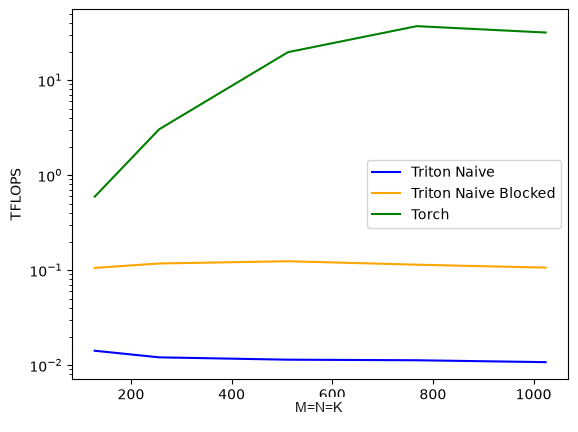
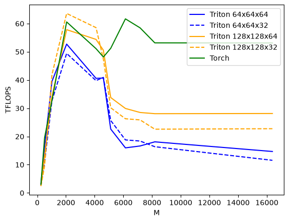

# Matrix Multiplication in Triton

We will now look at matrix multiplication in Triton, which is the core operation in GEMM (General Matrix Multiplication).
Assume we have two matrices A and B, and we want to compute the matrix product C = A @ B.
The matrix A is of size MxK and the matrix B is of size KxN, and the matrix C is of size MxN.

## Naive Implementation

The C[i,j] element is computed as:
```
C[i,j] = sum_{k=0}^{K-1} A[i,k] * B[k,j]
```

The naive implementation is to compute each element of the C separately in a different program.

```python
@triton.jit
def matrix_multiplication_kernel_naive(
    a_ptr, b_ptr, c_ptr,
    M, N, K, # a is MxK, b is KxN, c is MxN
    a_row_stride, b_row_stride, c_row_stride,
    a_col_stride, b_col_stride, c_col_stride,
):
    row = tl.program_id(0)
    col = tl.program_id(1)
    # Accumulate in fp32 for both fp16 and fp32 inputs. tl.store casts the
    # result to c_ptr's element type, so the output dtype matches the input.
    acc = tl.zeros([], dtype=tl.float32)
    for k in range(K):
        a_val = tl.load(a_ptr + row * a_row_stride + k * a_col_stride)
        b_val = tl.load(b_ptr + k * b_row_stride + col * b_col_stride)
        acc += a_val.to(tl.float32) * b_val.to(tl.float32)
    c_m_n_ptr = c_ptr + row * c_row_stride + col * c_col_stride
    tl.store(c_m_n_ptr, acc)

def matrix_multiplication_naive(a: torch.Tensor, b: torch.Tensor):
    assert a.ndim == 2 and b.ndim == 2, "expected two 2D matrices"
    M, K = a.shape
    K_b, N = b.shape
    assert K == K_b, "incompatible matrix dimensions"
    assert a.device == b.device, "A and B must be on the same device"
    assert a.dtype == b.dtype, "A and B must have the same dtype"
    assert a.dtype in (torch.float16, torch.float32), "only fp16 and fp32 are supported"
    c = torch.empty((M, N), device=a.device, dtype=a.dtype)
    matrix_multiplication_kernel_naive[(M, N)](
        a, b, c, M, N, K,
        a.stride(0), b.stride(0), c.stride(0),
        a.stride(1), b.stride(1), c.stride(1),
    )
    return c
```

We launch an MxN grid, matching the shape of C, and each program computes one output element.
For C[i,j], the program IDs provide `i = tl.program_id(0)` and `j = tl.program_id(1)`.
At inner-loop step k, the program loads A[i,k] and B[k,j].
The address of A[i,k] is `a_ptr + i * a_row_stride + k * a_col_stride`.
Similarly, the address of B[k,j] is `b_ptr + k * b_row_stride + j * b_col_stride`.
Passing both row and column strides allows the kernels to handle strided inputs, including transposed matrices.
The scalar accumulator starts at zero and remains FP32 for both supported input dtypes.
Finally, `tl.store` converts the FP32 accumulator to C's element type, so the output has the same dtype as the inputs.

For each output element, this implementation requests K elements from A and K elements from B, then stores one element in C.
Using the standard GEMM counting convention, it performs approximately 2K FLOPs per output element: K multiplications and K additions.

## Naive Blocked Implementation

The question we want to answer is would doing the inner loop in blocks of size BLOCK_SIZE_K improve the performance?

```python
@triton.jit
def matrix_multiplication_kernel_naive_blocked(
    a_ptr, b_ptr, c_ptr,
    M, N, K, # a is MxK, b is KxN, c is MxN
    a_row_stride, b_row_stride, c_row_stride,
    a_col_stride, b_col_stride, c_col_stride,
    BLOCK_SIZE_K: tl.constexpr,
):
    row = tl.program_id(0)
    col = tl.program_id(1)
    acc = tl.zeros([], dtype=tl.float32)
    for k in range(0, K, BLOCK_SIZE_K):
        a_start_ptr = a_ptr + row * a_row_stride
        b_start_ptr = b_ptr + col * b_col_stride

        k_offsets = tl.arange(0, BLOCK_SIZE_K) + k
        k_mask = k_offsets < K

        a_offsets = k_offsets * a_col_stride
        b_offsets = k_offsets * b_row_stride

        a_ptrs = a_start_ptr + a_offsets
        b_ptrs = b_start_ptr + b_offsets

        a_vals = tl.load(a_ptrs, mask=k_mask, other=0.0).to(tl.float32)
        b_vals = tl.load(b_ptrs, mask=k_mask, other=0.0).to(tl.float32)

        acc += tl.sum(a_vals * b_vals)

    c_m_n_ptr = c_ptr + row * c_row_stride + col * c_col_stride
    tl.store(c_m_n_ptr, acc)

def matrix_multiplication_naive_blocked(a: torch.Tensor, b: torch.Tensor):
    assert a.ndim == 2 and b.ndim == 2, "expected two 2D matrices"
    M, K = a.shape
    K_b, N = b.shape
    assert K == K_b, "incompatible matrix dimensions"
    assert a.device == b.device, "A and B must be on the same device"
    assert a.dtype == b.dtype, "A and B must have the same dtype"
    assert a.dtype in (torch.float16, torch.float32), "only fp16 and fp32 are supported"
    BLOCK_SIZE_K = 128
    c = torch.empty((M, N), device=a.device, dtype=a.dtype)
    matrix_multiplication_kernel_naive_blocked[(M, N)](
        a, b, c, M, N, K,
        a.stride(0), b.stride(0), c.stride(0),
        a.stride(1), b.stride(1), c.stride(1),
        BLOCK_SIZE_K,
    )
    return c
```

This implementation loads the inner loop in blocks of size BLOCK_SIZE_K.
Instead of loading individual A[i,k] and B[k,j] values, it A[i,k_start:k_end] and B[k_start:k_end,j].
Since the K may not be divisible by BLOCK_SIZE_K, we need to use a mask to prevent out-of-bounds loads.

While the total number of FLOPs is the same, there are 2 significant differences between the two implementations.
First, instead of loading, multiplying, and adding 1 element at a time, we are loading BLOCK_SIZE_K elements at a time, multiplying, and adding them.
This reduces the instruction count, and increases the parallelism.
Second, the access to A matrix is coalesced since we are loading contiguous values from the A matrix.
On the other hand, the access to B matrix is not coalesced since we are loading values from different rows of the B matrix.

Let's benchmark these two implementations with FP16 matrices and compare them with the torch matmul function.
We will be using square matrices here.



We can see that the blocked naive Triton implementation is ~10x faster than the naive Triton implementation while performing way worse than the torch matmul function as one can expect.

## Tiled Implementation

In previous implementation, we moved to a blocked implementation for the inner loop.
Now, we will also use blocks for the outer loop.
In tile matmul, each program computes one output tile C[m_tile, n_tile] of size BLOCK_SIZE_M x BLOCK_SIZE_N.
To compute this, the program reads
- One row strip of A: rows m_tile * BLOCK_SIZE_M to m_tile * BLOCK_SIZE_M + BLOCK_SIZE_M - 1, all K columns. Call this A_m
- One column strip of B: columns n_tile * BLOCK_SIZE_N to n_tile * BLOCK_SIZE_N + BLOCK_SIZE_N - 1, all K rows. Call this B_n

Thanks to the tiling, access to the both A and B matrices is coalesced.

```python
@triton.jit
def matrix_multiplication_tiled_kernel(
    a_ptr, b_ptr, c_ptr,
    M, N, K, # a is MxK, b is KxN, c is MxN
    a_row_stride, b_row_stride, c_row_stride,
    a_col_stride, b_col_stride, c_col_stride,
    BLOCK_SIZE_M: tl.constexpr,
    BLOCK_SIZE_N: tl.constexpr,
    BLOCK_SIZE_K: tl.constexpr,
):
    row = tl.program_id(0) * BLOCK_SIZE_M
    col = tl.program_id(1) * BLOCK_SIZE_N

    m_offsets = tl.arange(0, BLOCK_SIZE_M) + row
    m_mask = m_offsets < M

    n_offsets = tl.arange(0, BLOCK_SIZE_N) + col
    n_mask = n_offsets < N

    acc = tl.zeros([BLOCK_SIZE_M, BLOCK_SIZE_N], dtype=tl.float32)
    for k in range(0, K, BLOCK_SIZE_K):
        k_offsets = tl.arange(0, BLOCK_SIZE_K) + k
        k_mask = k_offsets < K

        a_offsets = m_offsets[:, None] * a_row_stride + k_offsets[None, :] * a_col_stride # shape [BLOCK_SIZE_M, BLOCK_SIZE_K]
        b_offsets = k_offsets[:, None] * b_row_stride + n_offsets[None, :] * b_col_stride # shape [BLOCK_SIZE_K, BLOCK_SIZE_N]

        a_ptrs = a_ptr + a_offsets
        b_ptrs = b_ptr + b_offsets

        a_mask = m_mask[:, None] & k_mask[None, :]
        b_mask = k_mask[:, None] & n_mask[None, :]
        
        a_vals = tl.load(a_ptrs, mask=a_mask, other=0.0)
        b_vals = tl.load(b_ptrs, mask=b_mask, other=0.0)

        acc = tl.dot(a_vals, b_vals, acc)

    c_offsets = m_offsets[:, None] * c_row_stride + n_offsets[None, :] * c_col_stride
    c_mask = m_mask[:, None] & n_mask[None, :]
    tl.store(c_ptr + c_offsets, acc, mask=c_mask)

def matrix_multiplication_tiled(a: torch.Tensor, b: torch.Tensor):
    assert a.ndim == 2 and b.ndim == 2, "expected two 2D matrices"
    M, K = a.shape
    K_b, N = b.shape
    assert K == K_b, "incompatible matrix dimensions"
    assert a.device == b.device, "A and B must be on the same device"
    assert a.dtype == b.dtype, "A and B must have the same dtype"
    assert a.dtype in (torch.float16, torch.float32), "only fp16 and fp32 are supported"
    BLOCK_SIZE_M = 64
    BLOCK_SIZE_N = 64
    BLOCK_SIZE_K = 64
    grid_size = (triton.cdiv(M, BLOCK_SIZE_M), triton.cdiv(N, BLOCK_SIZE_N))
    c = torch.empty((M, N), device=a.device, dtype=a.dtype)
    matrix_multiplication_tiled_kernel[grid_size](
        a, b, c, M, N, K,
        a.stride(0), b.stride(0), c.stride(0),
        a.stride(1), b.stride(1), c.stride(1),
        BLOCK_SIZE_M, BLOCK_SIZE_N, BLOCK_SIZE_K,
    )
    return c
```

First difference we should realize is that the grid size is now `(triton.cdiv(M, BLOCK_SIZE_M), triton.cdiv(N, BLOCK_SIZE_N))` instead of `(M, N)`.
That's because we are now computing one tile of the result matrix at a time in one program.
The row and column indices are also affected by the tiling as we can see, and we need to compute the offset and masks for the rows of A and the columns of B, m and n respectively.
Note that the accumulator is now a 2D array of size BLOCK_SIZE_M x BLOCK_SIZE_N, the same size as the output tile.

As we discussed, to compute the output tile C[m_tile, n_tile], we need to compute the dot product of A_m and B_n, which are now 2D arrays of size BLOCK_SIZE_M x K and K x BLOCK_SIZE_N respectively.
We do this operation in blocks of size BLOCK_SIZE_K in the inner loop.
The offsets for A and B are computed as `m_offsets[:, None] * a_row_stride + k_offsets[None, :] * a_col_stride` and `k_offsets[:, None] * b_row_stride + n_offsets[None, :] * b_col_stride` respectively.
Quite a bit symmetric as we like to see.
Then we compute the masks for A and B, `m_mask[:, None] & k_mask[None, :]` and `k_mask[:, None] & n_mask[None, :]` respectively.
We should realize that since we have both inner and outer blocks, the masks may have False values in both dimensions.

Finally, we do the same offset and mask computation for the output tile and save the results.

Now, let's compare the performance of the tiled implementation with different block sizes (BLOCK_SIZE_MxBLOCK_SIZE_NxBLOCK_SIZE_K) and compare it with the torch matmul function.
We will be using square matrices once again.



matmul-tiled-vs-torch-fp16:
          M        N        K  Triton 64x64x64  Triton 64x64x32  Triton 128x128x64  Triton 128x128x32      Torch
0     256.0    256.0    256.0         3.277117         2.677999           2.638757           2.413236   3.044038
1     512.0    512.0    512.0        16.363027        10.972446          13.228417           9.628797  19.607187
2    1024.0   1024.0   1024.0        39.500768        32.638791          34.178652          41.845382  32.695045
3    2048.0   2048.0   2048.0        52.727315        49.424401          57.844617          63.590078  60.582112
4    4096.0   4096.0   4096.0        40.592372        39.786075          54.389835          58.560366  51.110964
5    4608.0   4608.0   4608.0        40.706320        40.929206          50.553000          47.368670  48.158197
6    5120.0   5120.0   5120.0        22.628278        25.640121          33.793592          30.160854  51.234158
7    6144.0   6144.0   6144.0        15.961657        18.780186          29.921488          26.273706  61.671232
8    7168.0   7168.0   7168.0        16.633684        18.375466          28.497214          25.864553  58.471390
9    8192.0   8192.0   8192.0        18.099467        16.371548          28.072610          22.572190  53.165160
10  16384.0  16384.0  16384.0        14.678573        11.551419          28.131726          22.752708  53.134803

Remember that for the L4 GPU, we have the following properties:
- 58 SMs
- 48 MB L2
- 300 GB/s memory bandwidth
- 121 TFLOP/s FP16 performance

Now, let's try to make sense of the results we are seeing.

### Why do we have a large drop in performance as we increase the matrix size from 4608 to 5120?

As we said before, we are using FP16 square matrices here.
The memory of such a matrix is 2N^2 bytes.
For the 4608x4608 matrix, this is 40.5 MB, and for the 5120x5120 matrix, this is 50 MB.
The largest square matrix that can fit in the L2 cache is

```
\(n_\text{max}
=
\sqrt{\frac{48\cdot2^{20}}{2}}
\approx5017\)
```

In this implementation, we do not have an explicit grouped tile ordering.
Because of that, while for 4096 and 4608 matrices, one of the operands can reasonably fit in the L2 cache, after that point, programs can sweep too far across one grid dimension before returning to an operand tile which has already been evicted from the L2 cache.
Of course, it's not just one operand taking space in the L2 cache, but after that point, 5017, we can't theoritically fit an operand anymore in the L2 cache.

Why 128×128 eventually beats 64×64
For one square \(T\times T\) output tile and the full K dimension, a program performs:
\[
2T^2K \text{ FLOPs}
\]Ignoring inter-program cache reuse, it reads approximately:
\[
2TK + 2KT = 4TK \text{ bytes}
\]because FP16 occupies two bytes. Therefore:
\[
AI_{\text{program}} =
\frac{2T^2K}{4TK}
=\frac{T}{2}
\]That gives:
Tile	Program-local arithmetic intensity
64×64	32 FLOP/byte
128×128	64 FLOP/byte


A 128×128 tile loads twice as much A and B data as a 64×64 tile, but computes four times as many outputs. Thus it gets twice as much work from each byte.
If L2 scheduling lets programs reuse approximately one operand between adjacent output tiles, the effective DRAM intensities become roughly:
Tile	Effective HBM intensity	300 GB/s roof
64×64	~64 FLOP/byte	~19.2 TFLOP/s
128×128	~128 FLOP/byte	~38.4 TFLOP/s


Compare that with your \(N=16384\) measurements:
64×64: 14.69 TFLOP/s
128×128: 27.56 TFLOP/s
Those correspond to roughly:
\[
14.69/64 \approx 230\ \text{GB/s}
\]and:
\[
27.56/128 \approx 215\ \text{GB/s}
\]That is remarkably consistent with both kernels becoming DRAM-bandwidth-bound, with 128×128 having approximately twice the useful work per DRAM byte.